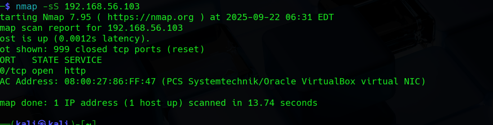
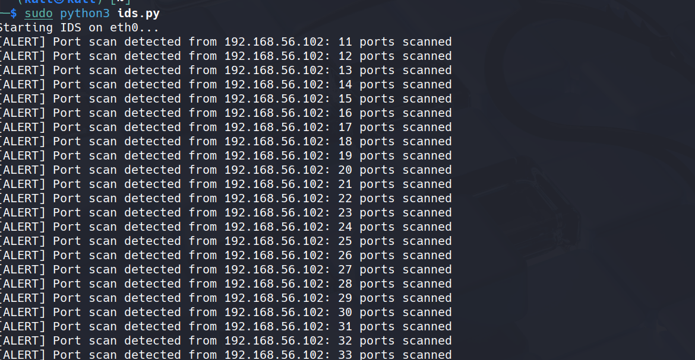
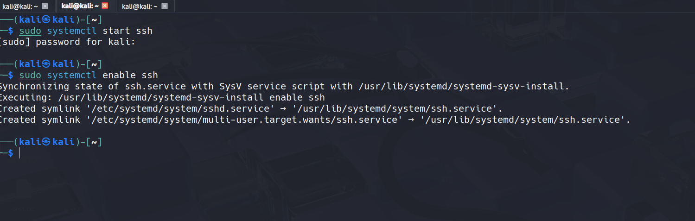
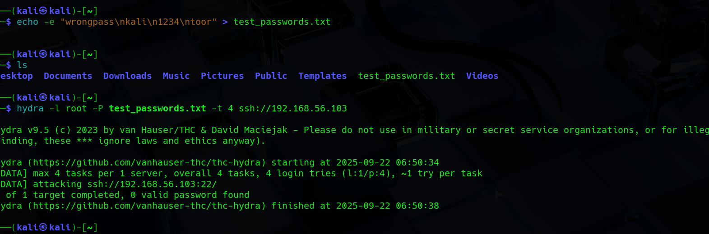
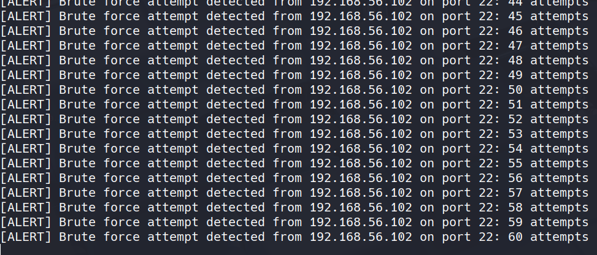
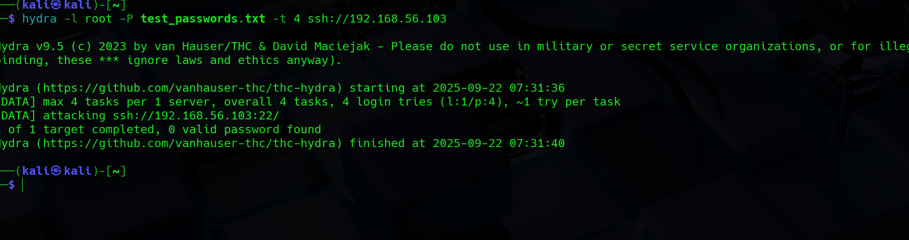
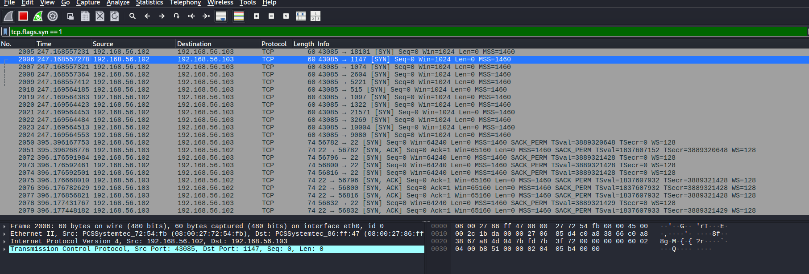
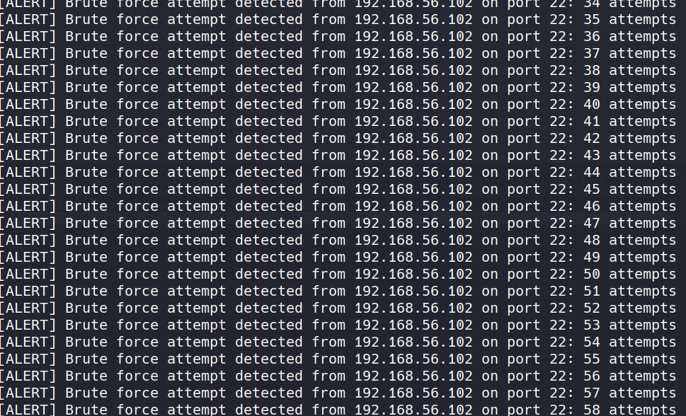

# Custom Intrusion Detection System (IDS)  

1. Update Kali Linux
- command run: `sudo apt update && sudo apt upgrade -y`
2. Verify Python installation
- command run: `python3 --version`
3. Install scapy
- commmand run: `sudo pip3 install scapy`
4. Install Wireshark
- command run:
```
sudo apt install wireshark -y
sudo dpkg-reconfigure wireshark-common  # Select Yes
sudo usermod -aG wireshark $USER        # Add user to Wireshark group
```
5. Install VirtualBox
- command run: `sudo apt install virtualbox -y`

6. Set up VMs
- VM1: Kali IDS
- VM2: Kali Attacker
- VM3: Metasploitable (target)
- Network: Host-Only Adapter, Promiscuous Mode: Allow All

7. Assign static IPs (Host only network)
- [ example not original ip]
- Kali IDS: 192.168.00.00
- Kali Attacker: 192.168.00.00 
- Metasploitable: 192.168.00.00

```
sudo ip addr add 192.168.00.00/24 dev eth0
sudo ip link set eth0 up
```
- repeat for other VMs

8.  Verify Connectivity
```
ping 192.168.56.11  # From IDS
ping 192.168.56.12  # From IDS
```
9. Create IDS Python script
- command run: `sudo python3 ids.py`

```ids.py```

```
from scapy.all import *
import time
from collections import defaultdict

# Configuration
THRESHOLD_PORT_SCAN = 10  # Flag if 10+ ports scanned in TIME_WINDOW
THRESHOLD_BRUTE_FORCE = 5  # Flag if 5+ attempts to port 22 in TIME_WINDOW
TIME_WINDOW = 10  # seconds
TARGET_PORT = 22  # SSH port
LOG_FILE = "ids_alerts.log"

# Trackers
port_scan_tracker = defaultdict(list)
brute_force_tracker = defaultdict(list)

def log_alert(message):
    """Log alert to file and print."""
    timestamp = time.strftime("%Y-%m-%d %H:%M:%S")
    with open(LOG_FILE, "a") as f:
        f.write(f"[{timestamp}] {message}\n")
    print(f"[ALERT] {message}")

def packet_callback(packet):
    """Analyze packets."""
    if packet.haslayer(TCP):
        src_ip = packet[IP].src
        dst_port = packet[TCP].dport
        current_time = time.time()

        # Port scan detection (SYN packets)
        if packet[TCP].flags == "S":
            port_scan_tracker[src_ip].append((dst_port, current_time))
            port_scan_tracker[src_ip] = [(p, t) for p, t in port_scan_tracker[src_ip] if current_time - t < TIME_WINDOW]
            if len(set(p for p, _ in port_scan_tracker[src_ip])) > THRESHOLD_PORT_SCAN:
                log_alert(f"Port scan detected from {src_ip}: {len(set(p for p, _ in port_scan_tracker[src_ip]))} ports scanned")

        # Brute force detection (SSH)
        if dst_port == TARGET_PORT:
            brute_force_tracker[src_ip].append(current_time)
            brute_force_tracker[src_ip] = [t for t in brute_force_tracker[src_ip] if current_time - t < TIME_WINDOW]
            if len(brute_force_tracker[src_ip]) > THRESHOLD_BRUTE_FORCE:
                log_alert(f"Brute force attempt detected from {src_ip} on port {TARGET_PORT}: {len(brute_force_tracker[src_ip])} attempts")

def start_ids(interface="eth0"):
    """Start IDS packet sniffing."""
    print(f"Starting IDS on {interface}...")
    sniff(iface=interface, prn=packet_callback, filter="tcp", store=0)

if __name__ == "__main__":
    start_ids(interface="eth0")
```
10. Switch to the Attacker VM (Kali or another VM).
- scan kali IDS ip
- command run:

```
nmap -sS 192.168.56.10 
```


11. Switch to the Kali IDS VM terminal (where ids.py is running).



12. start the SSH service on the IDS VM

```
sudo systemctl start ssh
sudo systemctl enable ssh   # optional, starts SSH on boot

```


13. Simulate SSH brute force attack from attacker VM:
- command run: `sudo gunzip /usr/share/wordlists/rockyou.txt.gz`
- comand run: `hydra -l root -P /usr/share/wordlists/rockyou.txt ssh://192.168.56.103`

14. use a small test password file
- command run: `echo -e "wrongpass\nkali\n1234\ntoor" > test_passwords.txt`

15. Hydra run Successfully:





16. validate with wireshark
- command run: `wireshark &`
- Select eth0 (your Host-Only adapter) and click the blue shark fin / start capture button.
- In the display filter bar, type: `tcp.flags.syn == 1`
- Press Enter (or click the arrow button next to the filter).

17. run attacks from the attacker VM
- command run: `nmap -sS 192.168.56.103`
- command run: `hydra -l root -P test_passwords.txt -t 4 ssh://192.168.56.103`






18. Observe IDS Alerts

- Check the IDS terminal or log file ids_alerts.log. You should see alerts like:
```
[ALERT] Port scan detected from 192.168.56.102: 12 ports scanned
[ALERT] Brute force attempt detected from 192.168.56.102 on port 22: 6 attempts
```
- Each alert corresponds to the attacks you ran from the attacker VM.

19. Verify with Wireshark
- For port scans: Use filter tcp.flags.syn == 1 → shows SYN packets from attacker.
- For SSH brute force: Use filter tcp.port == 22 → shows repeated login attempts.
- Compare Wireshark packets with IDS alerts to confirm detection works correctly.

20. Project Completion
- ✅ Your IDS is now fully functional:
- Detects port scans using SYN packets.
- Detects SSH brute force attempts.
- Logs all alerts with timestamps.
- Can be validated visually with Wireshark captures.

21. Safety Notes
- Run only in isolated Host-Only network.
- Use VM snapshots for rollback if something goes wrong.
- Never test on public networks without permission.